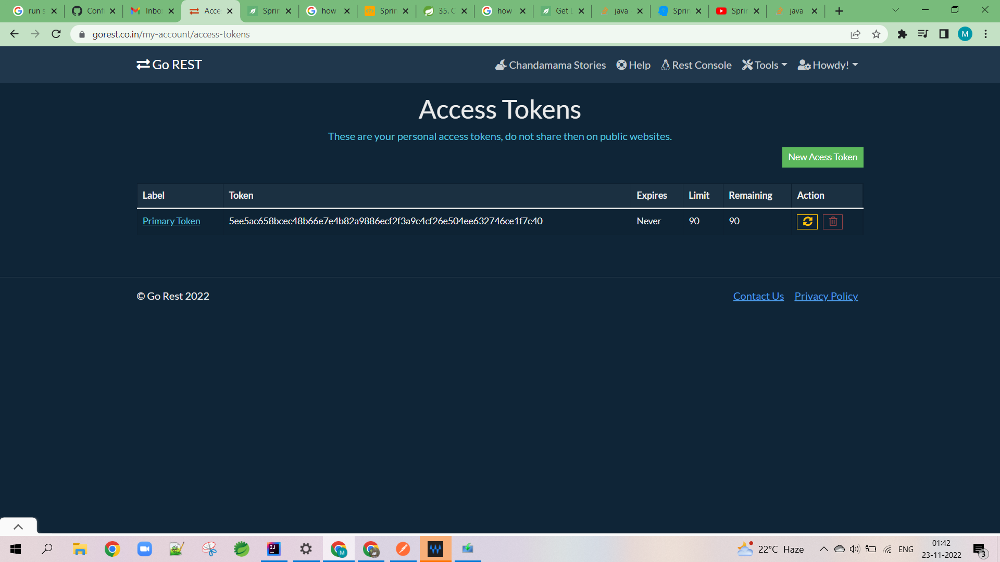

#rest-responsecode-change
This application response code for a rest endpoint is changes in two ways
1. By passing ServerHttpResponse as a parameter => EmployeeController flow
2. By returning ResponseEntity as a wrapper to the actual return type. => UserControlerr flow

This application uses and open api online
https://gorest.co.in/

to get all users
https://gorest.co.in/public/v2/users

http://localhost:8080/users/all

to get a specific user
http://localhost:8080/users/4222

to create a user
http://localhost:8080/users/add
{
"name": "SHARMA",
"email": "sharma@go.co",
"gender": "male",
"status": "active"
}

user below bearer token for POST method

5ee5ac658bcec48b66e7e4b82a9886ecf2f3a9c4cf26e504ee632746ce1f7c40